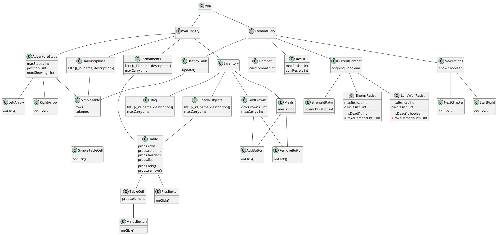

```plantuml
@startuml
class "App" as app
class "WarRegitry" as wr
class "CombatDiary" as cd

class "KaiDisciplines" as kd {
	list : [{_id, name, description}]
}
class "AdventureSteps" as as {
	maxSteps : int
	position : int
	numShowing : int
}
class "Armaments" as a {
	list : [{_id, name, description}]
	maxCarry : int
}
class "Inventory" as i {

}

class "Bag" as b {
	list : [{_id, name, description}]
	maxCarry : int
}
class "Meals" as m {
	meals : int
}
class "GoldCrowns" as gc {
	goldCrowns : int
	maxCarry : int
}
class "SpecialObjects" as so {
	list : [{_id, name, description}]
	maxCarry : int
}

class "NewActions" as na {
	show : boolean
}
class "Combat" as c {
	currCombat : int
}
class "Resist" as r {
	maxResist : int
	currResist : int
}
class "CurrentCombat" as cc {
	ongoing : boolean
}
class "DestinyTable" as dt {
	update()
}

class "StartFight" as sf {
	onClick()
}
class "NextChapter" as nc {
	onClick()
}

class "LoneWolfResist" as lwr {
	maxResist : int
	currResist : int
	isDead() : boolean
	-takeDamage(int) : int
}
class "StrenghtRatio" as sr {
	strenghtRatio : int
}
class "EnemyResist" as er {
	maxResist : int
	currResist : int
	isDead() : int
	-takeDamage(int) : int
}


class "SimpleTable" as st {
	rows
	columns
}
class "SimpleTableCell" as stc {
	onClick()
}

class "Table" as t {
	props.rows
	props.columns
	props.headers
	props.list
	props.add()
	props.remove()
}
class "TableCell" as tc {
	props.element
}
class "PlusButton" as pb {
	onClick()
}
class "MinusButton" as mb {
	onClick()
}

class "AddButton" as ab {
	onClick()
}
class "RemoveButton" as rb {
	onClick()
}
class "LeftArrow" as la {
	onClick()
}
class "RightArrow" as ra {
	onClick()
}


app -- wr
app -- cd

wr -[hidden]right- cd

	wr -- kd
		kd -- st
	wr -- a
		a -- t

	wr -- i
		i -- b
			b -- t

	wr -- as
		as -- la
		as -- st
		as -- ra

		i -- m
			m -- ab
			m -- rb

		i -- gc
			gc -- ab
			gc -- rb

		i -- so
			so -- t


	cd -- na
		na -- sf
		na -- nc

	cd -- c
	cd -- r
	cd -- cc
		cc -- lwr
		cc -- sr
		cc -- er

	cd -- dt
		as -[hidden]right- dt
		dt -- st

st -- stc

t -- pb
t -- tc
	tc -- mb


@enduml
```